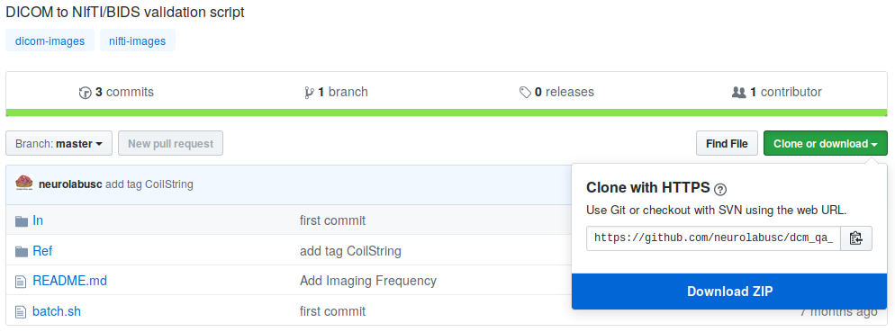

# Tutorial

## Setup

Create a new folder for this tutorial.

```bash
mkdir dcm2bids-tutorial
cd dcm2bids-tutorial
```

You can skip this part and go to the next [section](#scaffolding) if `dcm2niix` and `dcm2bids` are already installed.

The tutorial suppose that [conda][conda] is installed and correctly setup on your computer. It is the easiest way to install dcm2bids and its dependencies on any OS.

You should know that this is not the best way because conda does not always have the last version of dcm2niix.

Create a new file `environment.yml` with your favorite text editor with this content:

```yaml
name: dcm2bids
channels:
    - conda-forge
dependencies:
    - dcm2niix
    - dcm2bids
    - pip
```

Finaly, create a new conda environment to install dcm2bids:

```bash
conda env create -f environment.yml
source activate dcm2bids
pip install dcm2bids
```

We should have access to `dcm2bids` now. Test it with `dcm2bids --help`.

## Scaffolding

We can now run the command `dcm2bids_scaffold`. This gives us several generics folders and files. We can have a look at these files and consult the [BIDS specification][bids-spec] for more information.

One of the created folders is named `sourcedata`, this is the folder to put your DICOMs

## Downloading test data

For this tutorial, we will use DICOMs from [neurolabusc](https://github.com/neurolabusc) on github.

Go to : [https://github.com/neurolabusc/dcm_qa_nih](https://github.com/neurolabusc/dcm_qa_nih) and click on the *Clone or download* button to download as ZIP.



Move the zip file to the sourcedata folder and unzip it. Here is how to do it in the terminal but we could do it the way we want.

```bash
mv ~/Downloads/dcm_qa_nih-master.zip sourcedata/
cd sourcedata
unzip dcm_qa_nih-master.zip
cd ..
```

We should have now a `dcm_qa_nih-master` folder inside sourcedata.

## DICOM to NIfTI conversion

`dcm2bids_helper -d sourcedata/dcm_qa_nih-master/In/`

This command will convert the DICOMs files to NIfTI files and save them inside `tmp_dcm2bids/helper/`.

We should see a list of compressed NIfTI files (`nii.gz`) with their resective sidecar files (`.json`). For this tutorial, we will only be interested in three acquisitions :

- `004_In_Axial_EPI-FMRI_(Interleaved_I_to_S)_20180918114023.nii.gz`
- `004_In_EPI_PE=PA_20180918121230.nii.gz`
- `003_In_EPI_PE=AP_20180918121230.nii.gz`

The first will be our resting state fMRI, the second and third our fieldmap EPI.

When you will do it with your DICOMs, you should do it with a typical session of one of your participant.

## Building the configuration file

Now we will create a configuration file called `dcm2bids_config.json` (this is just an example, it could be whatever we want) in the `code/` folder. Use any text editor to create the file with the contents:

```json
{
    "descriptions": []
}
```

For example, with our resting state fMRI we see in its sidecar that the field `"SeriesDescription"` is equal to `"Axial_EPI-FMRI_(Interleaved_I_to_S)"`. We can open `004_In_Axial_EPI-FMRI_(Interleaved_I_to_S)_20180918114023.json` to verify that.

This value could be match with a pattern `"Axial_EPI-FMRI*"`.

Unfortunately, this criteria is not enough and could match other files. See `006_In_Axial_EPI-FMRI_(Interleaved_S_to_I)_20180918114023.json`.

In this case we could add another criteria to match the acquisition by the filename of the sidecar with the pattern `"*Interleaved_I_to_S*"`.

With all this information we could then update our configuration file.

```json hl_lines="9"
{
    "descriptions": [
        {
        "dataType": "func",
        "modalityLabel": "bold",
        "customLabels": "task-rest",
        "criteria": {
            "SeriesDescription": "Axial_EPI-FMRI*",
            "SidecarFilename": "*Interleaved_I_to_S*"
            }
        }
    ]
}
```

For the two fieldmaps, we can see that with patterns of `"*EPI_PE=AP*"` or `"*EPI_PE=PA*"` on the filename is enough to match the correct acquisition.

We could then update our configuration file.

```json hl_lines="17 26"
{
    "descriptions": [
        {
        "dataType": "func",
        "modalityLabel": "bold",
        "customLabels": "task-rest",
        "criteria": {
            "SeriesDescription": "Axial_EPI-FMRI*",
            "SidecarFilename": "*Interleaved_I_to_S*"
            }
        },
        {
        "dataType": "fmap",
        "modalityLabel": "epi",
        "customLabels": "dir-AP",
        "criteria": {
            "SidecarFilename": "*EPI_PE=AP*"
            },
        "intendedFor": 0
        },
        {
        "dataType": "fmap",
        "modalityLabel": "epi",
        "customLabels": "dir-PA",
        "criteria": {
            "SidecarFilename": "*EPI_PE=PA*"
            },
        "intendedFor": 0
        }
    ]
}
```

For fieldmap, we added an `"intendedFor"` field to show that these fieldmaps should be use with our fMRI acquisition. Have a look at the explanation of [intendedFor](/docs/3-configuration/#intendedfor) in the documentation or in the [BIDS specification][bids-fmap].

## Running dcm2bids

We can now run dcm2bids:

```bash
dcm2bids -d sourcedata/dcm_qa_nih-master/In/ -p ID01 -c code/dcm2bids_config.json
```

A bunch of information is print to the terminal and we can verify that the data are now in BIDS.

```console
user@pc:data/$ ls sub-ID01/*
sub-ID01/fmap:
sub-ID01_dir-AP_epi.json  sub-ID01_dir-AP_epi.nii.gz
sub-ID01_dir-PA_epi.json  sub-ID01_dir-PA_epi.nii.gz

sub-ID01/func:
sub-ID01_task-rest_bold.json  sub-ID01_task-rest_bold.nii.gz
```

Files that were not grabbed stay in a temporary folder `tmp_dcm2bids/sub-{participant_id}`. In our case : `tmp_dcm2bids/sub-ID01`.

Have a look at `dcm2bids --help` or the other pages of the documentation for more information.

[bids-spec]: https://bids-specification.readthedocs.io/en/stable/
[bids-fmap]: https://bids-specification.readthedocs.io/en/stable/04-modality-specific-files/01-magnetic-resonance-imaging-data.html#fieldmap-data
[conda]: https://conda.io/en/latest/miniconda.html
